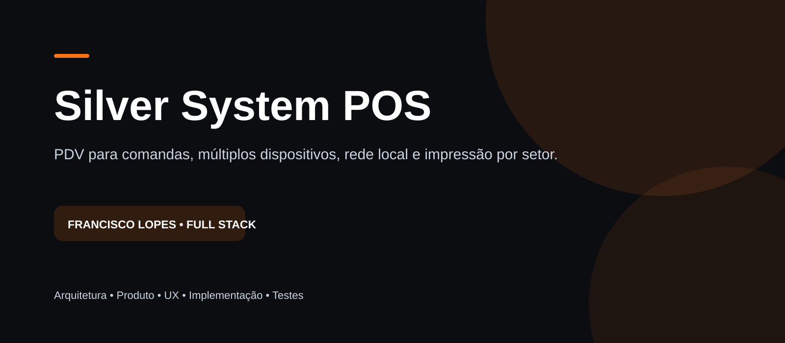
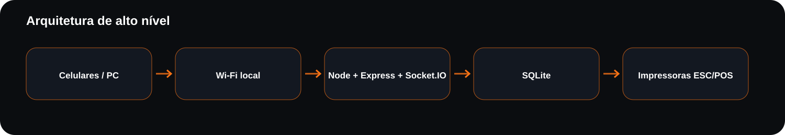
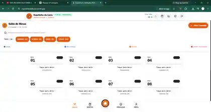

  

<h1 align="center">Silver System POS</h1>

  PDV para comandas, múltiplos dispositivos, rede local e impressão por setor.

  
  
  
  
  

> **Status:** Projeto comercial — documentação pública sem código-fonte de produção.

## Visão geral

A operação precisava registrar pedidos em diferentes dispositivos ao mesmo tempo, manter mesas e comandas sincronizadas e encaminhar impressões para setores distintos sem depender de internet externa.

Este repositório é uma **vitrine técnica/documental**. O objetivo é demonstrar decisões de arquitetura, produto, UX e engenharia sem publicar código proprietário, credenciais, dados reais ou configurações internas.

<table>
<tr>
<td align="center"><strong>12</strong> suítes E2E</td>
<td align="center"><strong>1.255</strong> requisições em testes</td>
<td align="center"><strong>20</strong> mesas no fluxo validado</td>
<td align="center"><strong>Local</strong> operação em rede Wi‑Fi</td>
</tr>
</table>

## Minha atuação

Atuação em **arquitetura, desenvolvimento full stack, integração, UX, validação, testes e refinamento da experiência**.

## Stack

React • Node.js • Express • Socket.IO • SQLite • Playwright • ESC/POS

## Principais funcionalidades

- Gestão de mesas e comandas
- Sincronização em tempo real entre dispositivos
- Persistência local centralizada
- Impressão ESC/POS por setor
- Controle de acesso por PIN
- Fluxo de fechamento e pagamento
- Testes E2E de operação

## Arquitetura

  

> O diagrama é propositalmente de alto nível para não expor detalhes sensíveis da implementação.

## Decisões técnicas

### Banco local centralizado
Todos os aparelhos trabalham sobre o mesmo estado no servidor local, evitando bancos independentes por dispositivo.

### Tempo real
Socket.IO distribui eventos de atualização para manter a operação sincronizada sem refresh manual.

### Impressão operacional
O fluxo foi projetado para direcionar pedidos a setores distintos por ESC/POS.

### Segurança aplicada
Validação de entradas, queries parametrizadas, proteção contra XSS e separação de configurações sensíveis.

## Screenshots

## Privacidade e confidencialidade

Este repositório **não contém**:

- código-fonte de produção;
- arquivos `.env`;
- chaves, tokens ou credenciais;
- banco de dados real;
- dados pessoais;
- configurações internas;
- segredos comerciais.

As imagens utilizadas aqui servem somente para apresentar o trabalho realizado e não devem ser reutilizadas como material oficial das empresas sem autorização.

## Autor

**Francisco Lopes de Sousa Filho**  
Desenvolvedor Full Stack

[GitHub](https://github.com/franciscolopesdev) • contactdevlps@gmail.com
